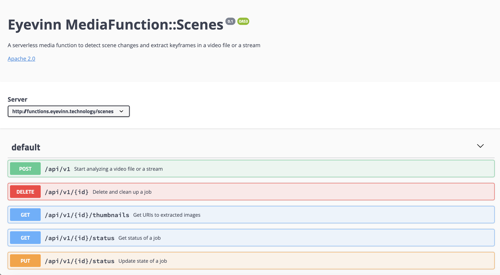

# Eyevinn MediaFunction::Scenes

A serverless media function to detect scene changes and extract keyframes in a video file or a stream.

## Build

Build the media function container and push to your docker registry.

```
$ docker build -t function-scenes:1 .
$ docker tag function-scenes:1 <your-repo>/function-scenes:1
$ docker push <your-repo>/function-scenes
```

To test the function you can run the container locally.

```
$ docker run --rm -d -p 3000:3000 --name=function-scenes function-scenes:1
```

API documentation is the available at `http://localhost:3000/api/docs/` and API on `http://localhost:3000/api/v1`.



Normally you would deploy the container to a cluster of your choice. This service requires sticky sessions when doing horizontal scaling.

## Usage

To detect the scene changes and extract images from a file.

1. Start a job by providing the media locator of the file.

```
$ curl -X POST "http://localhost:3000/api/v1" -H "accept: application/json" -H "Content-Type: application/json" -d "{\"medialocator\":\"https://s3-bucket/testfile.mp4\"}"
```

In return you should receive a JSON containing two endpoints:

```
{
  "thumbnails": "/api/v1/1/thumbnails",
  "status": "/api/v1/1/status"
}
```

2. Obtain the links to the extracted images using the `thumbnails` endpoint:

```
$ curl -v "http://localhost:3000/api/v1/1/thumbnails"
```

In return you receive a JSON with links to each image. This array is appended as scenes are detected and images extracted so a client typically polls this endpoint until the status of the job is completed.

These files are not to be considered persistent and it is expected that the client downloads and store these somewhere else. This function does not host any images.

3. To watch the status of the job use the `status` endpoint.

```
$ curl -v "http://localhost:3000/api/v1/1/status"
```

## Develop

When developing without rebuilding the image for every change this is one way of doing it. In essence mounting the source directory to a directory in the container that is run interactively.

```
$ docker build -t function-scenes:dev .
$ docker run --rm -it -p 3000:3000 -v $PWD:/appdev function-scenes:dev /bin/bash
root@811b2120dc75:/app# cd /appdev/
root@811b2120dc75:/appdev# DEBUG=* node index.js 
  function-scenes restify listening at http://[::]:3000 +0ms
```

## About Eyevinn Technology

Eyevinn Technology is an independent consultant firm specialized in video and streaming. Independent in a way that we are not commercially tied to any platform or technology vendor.

At Eyevinn, every software developer consultant has a dedicated budget reserved for open source development and contribution to the open source community. This give us room for innovation, team building and personal competence development. And also gives us as a company a way to contribute back to the open source community.

Want to know more about Eyevinn and how it is to work here. Contact us at work@eyevinn.se!

## LICENSE

Copyright 2019 Eyevinn Technology

Licensed under the Apache License, Version 2.0 (the "License");
you may not use this file except in compliance with the License.
You may obtain a copy of the License at

    http://www.apache.org/licenses/LICENSE-2.0

Unless required by applicable law or agreed to in writing, software
distributed under the License is distributed on an "AS IS" BASIS,
WITHOUT WARRANTIES OR CONDITIONS OF ANY KIND, either express or implied.
See the License for the specific language governing permissions and
limitations under the License.

